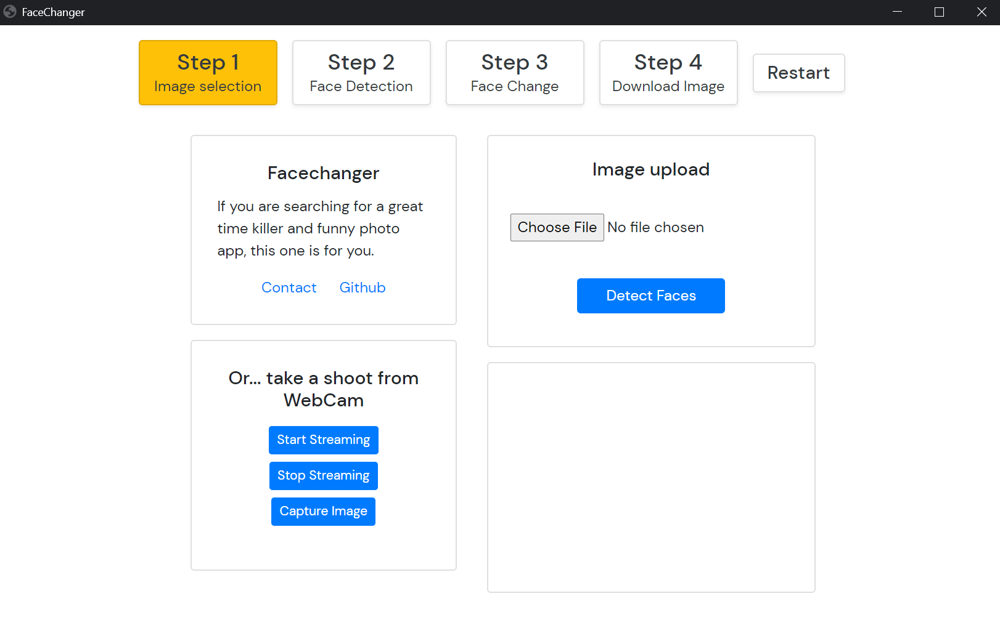

# facechanger_django
 A face change app based on Django.
 



 
 <!-- TABLE OF CONTENTS -->
## Table of Contents

* [About the Project](#about-the-project)
  * [Built With](#built-with)
* [Getting Started](#getting-started)
  * [Installation](#installation)
* [Usage](#usage)
* [License](#license)
* [Contact](#contact)

<!-- ABOUT THE PROJECT -->
## About The Project


This project is a small face change application that I developed for my internship.

You can:
* Detect all faces in a picture.
* Change the pictures on any face contain image.
* Download images as a jpeg file.
### Built With

* [Bootstrap](https://getbootstrap.com)
* [Django](https://https://www.djangoproject.com/.com)
* [Flaskwebgui](https://github.com/ClimenteA/flaskwebgui)
* [OpenCV](https://opencv.org/)
* [Pillow](https://python-pillow.org/)


<!-- GETTING STARTED -->
## Getting Started

You need be sure about Python 3.8 and Google Chrome is already installed.


### Installation

1. Download Python3.8 and Google Chrome.

2. Clone the repo
```sh
git clone https://github.com/Racherin/facechanger_django.git
```
3. Install virtualenv
```sh
pip install virtualenv
```
4. Enable virtualenv
```sh
virtualenv env
```
5. Install requirements
```sh
pip install -r requirements.txt
```
5. Run the server
```sh
python gui.py
```

## License

Distributed under the MIT License. See `LICENSE` for more information.


<!-- CONTACT -->
## Contact

mertavincan@gmail.com

Project Link: [https://github.com/Racherin/facechanger_django](https://github.com/Racherin/facechanger_django)

